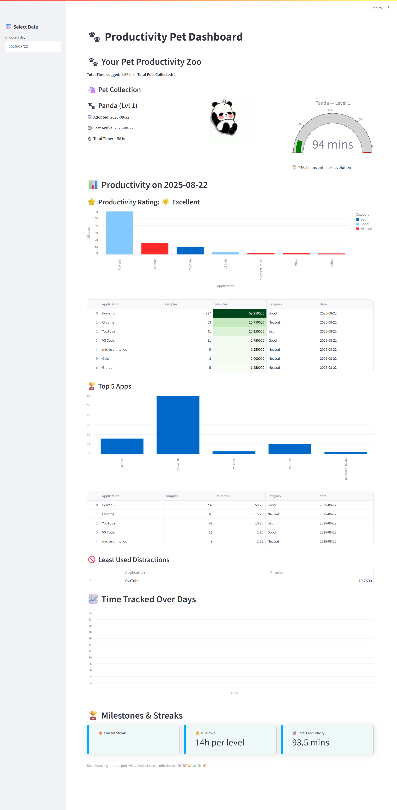

# 🐇Productitvity_analysis_gamification 🐾  
Gamified Personal Productivity Tracker with Optional Automation
---

## 🚀 Project Overview  
Productitvity_analysis_gamification is an innovative productivity and behavior analytics project designed to help users understand and improve their daily computer usage through gamification. By tracking active window usage locally and evolving virtual pets based on accumulated productive time, this project transforms mundane usage statistics into an engaging, motivating experience.

---

## 🎯 Features & Highlights

- **Local Usage Tracking**: Tracks app usage every 15 secs and classifies behavior (Good/Bad/Neutral) 
- **Pet Gamification**: Rewards focus time with evolving and unlocking virtual pets 
- **Streak & Milestone Recognition**: Daily summaries + milestone streaks, pet status and productivity ratings. 
- **Enhancements Possible**: Optional automation via GitHub Actions / Task Scheduler, introducing more engaging pet features. 
- **Data Visualization Ready**: Streamlit dashboard for clean, gamified visual insights
- **Configurable Thresholds**: Adjust accumulation thresholds, productivity mappings, and pet evolution stages.  

---

## 🛠 Tech Stack

- `Python` — Core language for tracking, analytics, and reporting.  
- `pandas` — Data processing and analytics.  
- `pygetwindow` — Active window detection (Windows).  
- `CSV` — Local persistence format, extensible to databases.  
- *(Optional)* `GitHub Actions` — Can automate pet growth/report generation.  
- *(Optional)* `Windows Task Scheduler` — Can automate tracking/analyzing.  

---

## 📈 How It Works

- **Tracking**: `tracker.py` logs the current active window every 15 seconds to `usage_log.csv`.  
- **Analyzing**: `analyze.py` processes usage logs, categorizes by productivity, updates streaks, and calculates pet evolution in `pets.csv`.  
- **Visualization**: `app.py` (Streamlit) reads updated files to show gamified reports (pets, streaks, app usage).  
- **Gamification Logic**:  
  - Pets evolve every 14 hours of productive time.  
  - New pets unlock at streak milestones: 1, 2, 5, 10, 15 days, etc.  

---

## ⚙️ Setup & Installation

### 🔧 Prerequisites

- Python 3.8+ installed locally  
- Windows OS (for `pygetwindow`)  
- Git & GitHub account  

### 💻 Local Setup

```bash
git clone https://github.com/yourusername/pet-zoo-tracker.git
cd pet-zoo-tracker
pip install -r requirements.txt  # pandas, pygetwindow
````

---

## ▶️ Running the Project

### ✅ Step 1: Start Tracking

```bash
python tracker.py
```

> 🔁 Keep this running in the background to log your current activity.

---

### ✅ Step 2: Analyze Your Usage

```bash
python analyze.py
```

> 🧠 Run this once at the end of the day (or any time) to update pets and reports.

---

### ✅ Step 3: Visualize Reports

```bash
streamlit run app.py
```

> 📊 This opens an interactive web app showing pets, streaks, and app usage data.

---

## ⚡ Optional Automation Setup

### 🌀 GitHub Actions (Optional)

You can automate the daily pet growth and commit results with GitHub Actions
> 🧪 *Automation is optional. Core project works manually.*

---

## 📁 Project Structure

```
pet-zoo-tracker/
├── tracker.py              # Active window logger
├── analyze.py              # Usage analyzer and pet logic
├── app.py                  # Streamlit report (optional)
├── pets.csv                # Auto-updated pet levels
├── usage_log.csv           # Raw usage log
├── daily_summary.csv       # Daily summary stats
├── accumulated_minutes.csv # Productive time accumulator
├── .github/workflows/
│   └── petzoo.yml          # (Optional) GitHub automation
├── requirements.txt        # Python dependencies
└── README.md
```

---

## 🎓 Skills Demonstrated

* Python scripting & local automation
* Real-time data collection & behavioral analytics
* File-based data processing (CSV manipulation)
* UX design via gamification
* (Optional) CI/CD orchestration with GitHub Actions
* Clean modular architecture

---

## 📊 Sample Image

![Initial_Report]

---

## 🤝 Contributing

Contributions and feature requests are welcome! Feel free to open issues or submit pull requests.

---

## 📜 License

This project is licensed under the **MIT License**. See [LICENSE](LICENSE) for details.

---

## 🔗 References

* [pygetwindow](https://github.com/asweigart/pygetwindow) for active window tracking
* [pandas](https://pandas.pydata.org/) for data processing
* [GitHub Actions Documentation](https://docs.github.com/en/actions)

---
